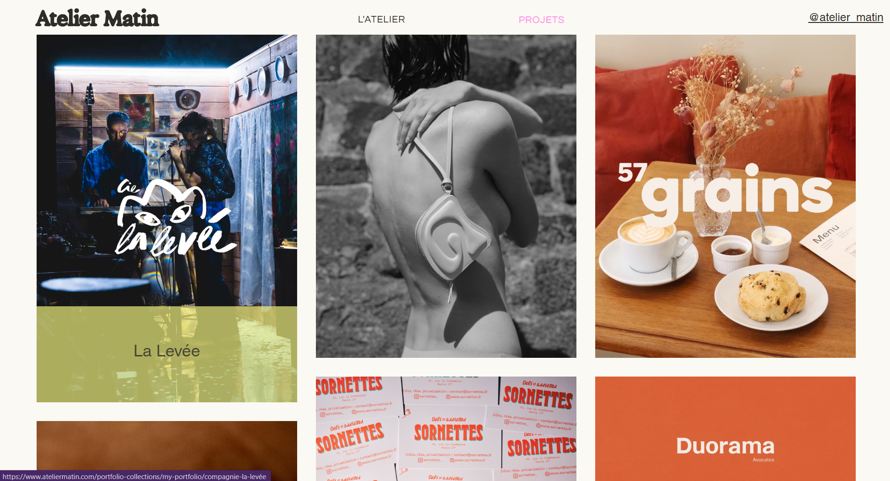
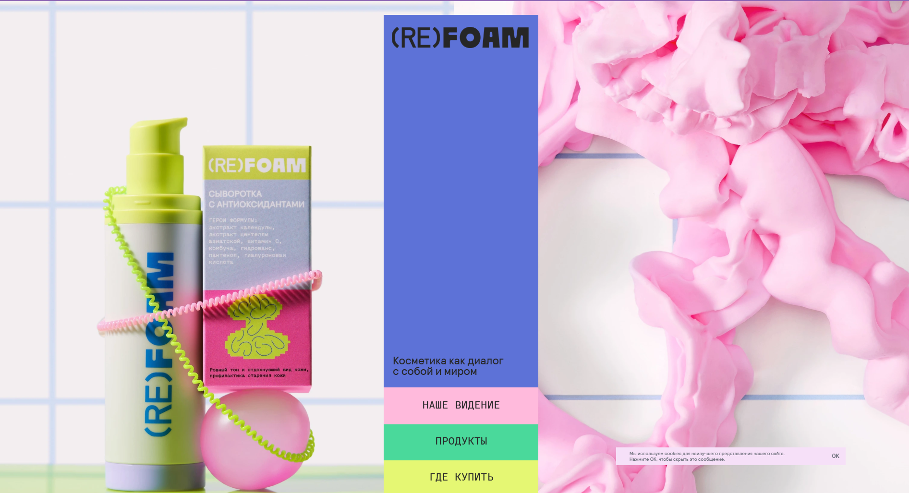
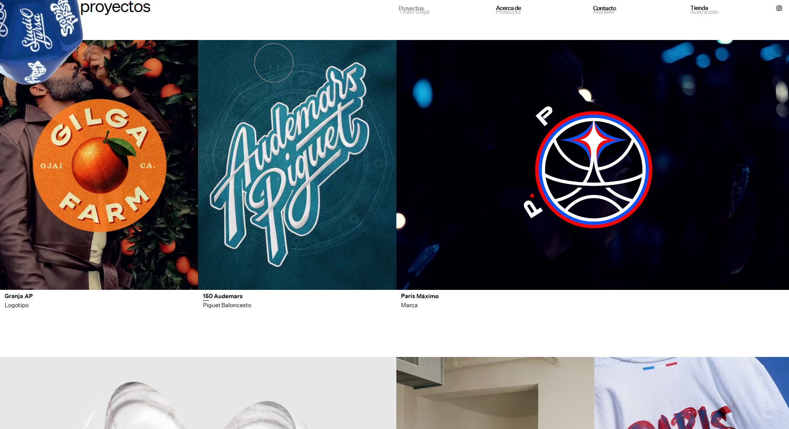
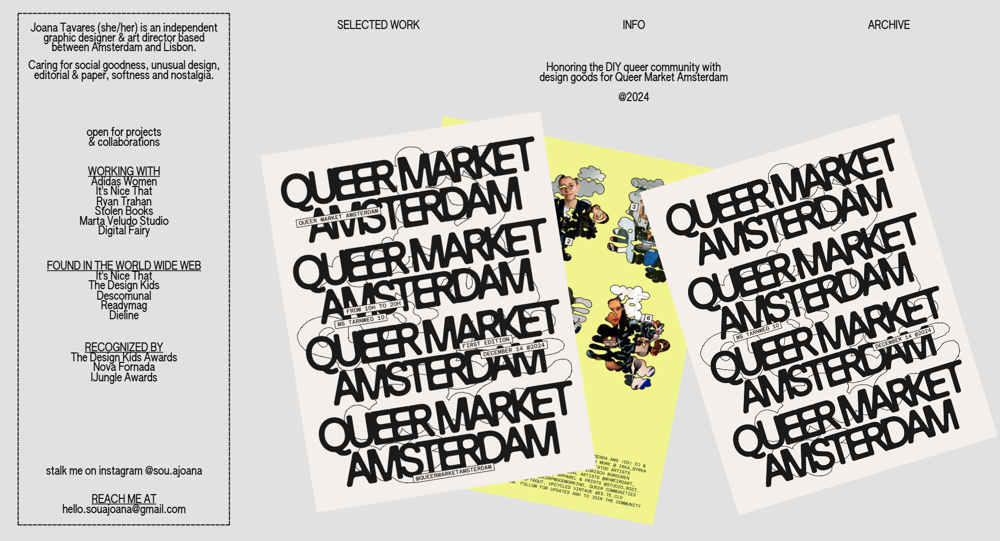
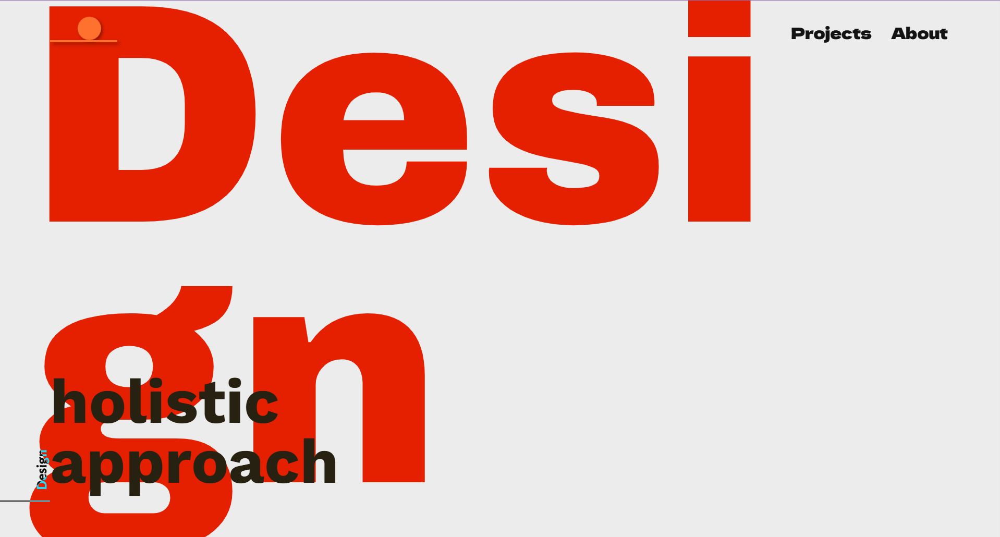
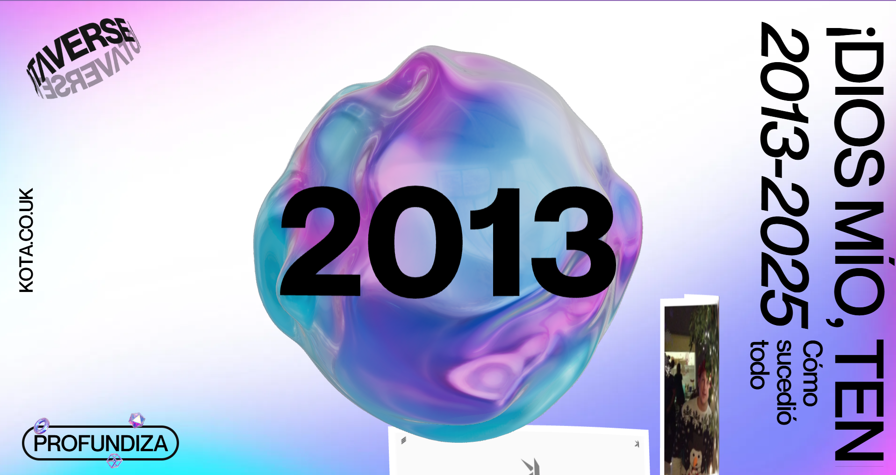
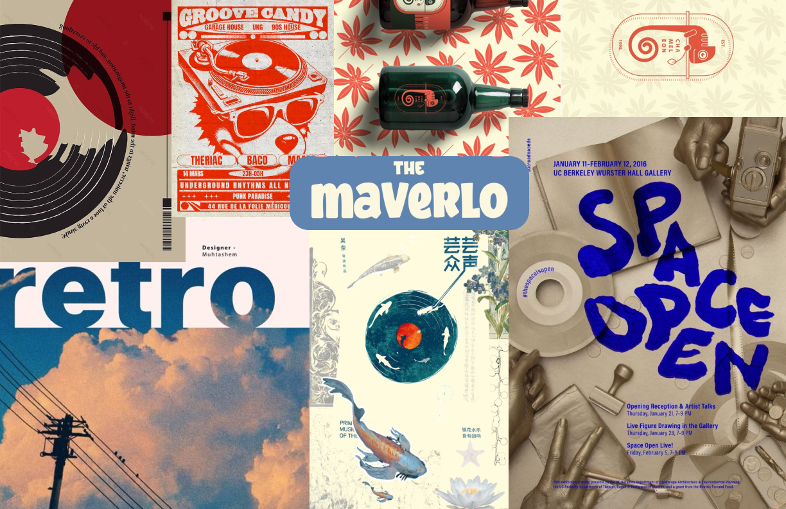

# Portafolio Ambar
## Objetivo General

Diseñar y desarrollar un portafolio digital profesional que comunique de manera clara, coherente y estratégica mi enfoque como diseñadora integral, destacando mi capacidad para vincular la investigación, la creatividad y la estrategia en el desarrollo de soluciones de diseño.

El propósito es fortalecer mi identidad profesional desde el diseño estratégico, evidenciando mi habilidad para abordar proyectos desde una mirada analítica, empática y multidisciplinaria, ampliando así las oportunidades de vinculación laboral en entornos creativos, innovadores y sociales.

---

## Usuarios

### Usuario Extremo 1 – Rodrigo Ibáñez

  
  
  <b>Cargo:</b> Director de Innovación y Desarrollo en empresa nacional de consumo 
  <b>Edad:</b> 43 años  
  
  <i><b>Rol en el ecosistema del diseño:</b></i> 
  Representa el polo más racional, analítico y corporativo del diseño estratégico. Su interés está en cómo el diseño genera valor competitivo, eficiencia y posicionamiento dentro del mercado.

 

<i><b>Comportamientos y creencias:</b></i> 
• Se guía por datos, métricas e impacto medible. 
• Cree que el diseño estratégico debe integrarse en la estructura de negocio como herramienta de innovación. 
• Prefiere diseñadores/as que sepan justificar cada decisión con argumentos de investigación y contexto. 
• Considera que la estética es importante solo si aporta claridad funcional o comunicativa. 
• Valora el pensamiento sistémico y la proyección de cada proyecto a largo plazo.

<i><b>Necesidades y objetivos:</b></i> 
• Encontrar diseñadoras que puedan detectar oportunidades de mercado y traducirlas en productos o servicios innovadores. 
• Evaluar portafolios que muestren proceso, análisis y resultados concretos. 
• Incorporar talento con pensamiento estratégico y visión interdisciplinaria, capaz de trabajar con ingeniería, marketing y desarrollo. 
• Identificar diseñadoras que comprendan viabilidad, escalabilidad y sostenibilidad de sus propuestas.

<i><b>Qué busca en mi portafolio:</b></i> 
• Claridad en la presentación de los procesos: investigación → hallazgos → propuesta → resultados. 
• Proyectos donde se evidencie razonamiento estratégico, no solo creatividad. 
• Evidencia de colaboración con otros actores o rubros. 
• Capacidad de traducir observaciones en decisiones de diseño argumentadas y medibles.

---

### Usuario Promedio – Sofía Contreras

  
  
  <b>Cargo:</b> Estudiante de último año de Diseño con enfoque estratégico 
  <b>Edad:</b> 23 años  
  
  <i><b>Rol en el ecosistema del diseño:</b></i> 
  Representa el punto medio entre la formación académica y la práctica profesional. Busca entender cómo aplicar el pensamiento estratégico en contextos reales, conectando la teoría con la acción.

 

<i><b>Comportamientos y creencias:</b></i> 
• Cree que el diseño estratégico es una herramienta para pensar, investigar y transformar contextos sociales o culturales. 
• Se interesa por proyectos con propósito y reflexión, más que por la estética aislada. 
• Revisa constantemente portafolios de diseñadores para inspirarse o entender cómo narrar procesos de forma clara. 
• Prefiere páginas simples, bien estructuradas y que expliquen cómo se llegó a las soluciones. 
• Valora el aprendizaje a través de referentes que integren investigación, creatividad y estrategia.

<i><b>Necesidades y objetivos:</b></i> 
• Comprender cómo se comunican procesos complejos dentro del diseño estratégico. 
• Encontrar ejemplos que le ayuden a estructurar su propio portafolio o discurso profesional. 
• Inspirarse en diseñadoras que combinen pensamiento analítico con sensibilidad estética. 
• Aprender cómo mostrar la coherencia entre problema, metodología y resultado.

<i><b>Qué busca en mi portafolio:</b></i> 
• <b>Inspiración narrativa:</b> Ver cómo otras diseñadoras cuentan sus historias de diseño de forma clara y estructurada. 
• <b>Ejemplos de proceso:</b> Portafolios que muestren el recorrido desde la investigación hasta la solución final. 
• <b>Colaboración interdisciplinaria:</b> Proyectos que evidencien trabajo con comunidades, ingeniería u otras disciplinas. 
• <b>Claridad metodológica:</b> Entender qué herramientas y métodos se usaron en cada etapa del proyecto. 
• <b>Coherencia visual-conceptual:</b> Ver cómo la identidad visual refuerza el discurso estratégico del portafolio.

# Portafolio Profesional

---

### Usuario Extremo 2 – Francisca Molina

  
  
  <b>Cargo:</b> Coordinadora de Proyectos de Innovación Ambiental y Sostenibilidad 
  <b>Edad:</b> 50 años  
  
  <i><b>Rol en el ecosistema del diseño:</b></i> 
  Representa el polo más empático, ético y comprometido con la innovación ambiental. Ve el diseño como una herramienta fundamental para la transición ecológica, la economía circular y la regeneración de ecosistemas.

<i><b>Comportamientos y creencias:</b></i> 
• Cree que el diseño estratégico debe aportar a la crisis climática con soluciones viables y regenerativas. 
• Valora proyectos que integren biomateriales, reducción de residuos y pensamiento de ciclo de vida. 
• Prefiere diseñadoras que trabajen con comunidades locales y conocimientos tradicionales para soluciones sostenibles. 
• Considera que el impacto ambiental debe ser medible y transparente en cada proyecto. 
• Busca innovación que equilibre tecnología, naturaleza y justicia social.

<i><b>Necesidades y objetivos:</b></i> 
• Identificar diseñadoras que integren sostenibilidad como eje central, no como añadido. 
• Ver portafolios donde el diseño responde a desafíos ambientales concretos (cambio climático, biodiversidad, economía circular). 
• Evaluar proyectos que demuestren análisis de impacto ambiental y huella ecológica. 
• Reconocer colaboraciones con ONGs ambientales, comunidades o centros de investigación en sostenibilidad. 
• Encontrar soluciones escalables que puedan replicarse en otros territorios.

<i><b>Qué busca en mi portafolio:</b></i> 
• <b>Impacto ambiental medible:</b> Proyectos que muestren reducción de huella de carbono, uso de materiales reciclados o regenerativos. 
• <b>Innovación circular:</b> Diseños que consideren el ciclo completo del producto (diseño para desmontaje, reutilización, compostaje). 
• <b>Co-diseño territorial:</b> Evidencia de trabajo con comunidades locales, respetando saberes ancestrales y contextos específicos. 
• <b>Pensamiento sistémico ambiental:</b> Proyectos que consideren ecosistemas completos, no solo productos aislados. 
• <b>Transparencia y datos:</b> Documentación clara de materiales, procesos y resultados ambientales alcanzados.

---

## Referentes

<table>
  <tr>
    <td valign="top" align="center" width="33%">
        
    </td>
    <td valign="top" align="center" width="33%">
        
    </td>
    <td valign="top" align="center" width="33%">
        
    </td>
  </tr>
  <tr>
    <td valign="top" width="33%">
      <b>¿Qué es?</b> <b>Atelier Matin</b> es un estudio francés especializado en identidad visual, dirección de arte e ilustración. Combina el trazo artístico con el significado, y el color con la intención, para crear identidades sensibles y duraderas.  
      <b>Fuente:</b> <a href="https://www.ateliermatin.com/">Atelier Matin</a>  
      <b>Aspectos destacados:</b> 
      <b>• Claridad estructural:</b> Diseño limpio con jerarquía visual clara entre texto e imagen que facilita la comprensión. 
      <b>• Profesionalismo tipográfico:</b> Uso adecuado del espacio en blanco y tipografía que transmite orden y sofisticación. 
      <b>• Coherencia visual:</b> Estilo consistente que enfoca la atención en los proyectos de forma equilibrada. 
      <b>• Navegación intuitiva:</b> Estructura simple que permite recorrer el portafolio de manera natural.  
      <b>Aspectos negativos:</b> 
      • Interacción mediante flechas genera fricción en la experiencia de usuario. 
      • Carece de dinamismo visual y elementos interactivos modernos. 
      • Se prioriza la estética sobre la comunicación del proceso estratégico.
    </td>
    <td valign="top" width="33%">
      <b>¿Qué es?</b> <b>(RE)FOAM</b> es un sitio de marca rusa de cuidado personal con fuerte identidad conceptual y estética minimalista que destaca sus productos de manera efectiva.  
      <b>Fuente:</b> <a href="https://re-foam.ru/">(RE)FOAM</a>  
      <b>Aspectos destacados:</b> 
      <b>• Fluidez visual:</b> Navegación clara e intuitiva con un flujo que guía naturalmente al usuario. 
      <b>• Calidad fotográfica:</b> Imágenes de alta calidad con diseño ordenado y atención al detalle. 
      <b>• Simplicidad efectiva:</b> La interfaz destaca los productos de manera directa sin saturación visual. 
      <b>• Minimalismo funcional:</b> Cada elemento tiene un propósito claro en la composición.  
      <b>Aspectos negativos:</b> 
      • Funciona principalmente como tienda, no muestra procesos de diseño o pensamiento estratégico. 
      • Falta narrativa estratégica detrás de las decisiones visuales. 
      • Interactividad limitada con estructura convencional de e-commerce.
    </td>
    <td valign="top" width="33%">
      <b>¿Qué es?</b> <b>Studio Tyrsa</b> es un estudio creativo parisino enfocado en tipografía, identidad visual y dirección de arte que crea imágenes significativas para proyectos inspiradores.  
      <b>Fuente:</b> <a href="https://www.studiotyrsa.com/">Studio Tyrsa</a>  
      <b>Aspectos destacados:</b> 
      <b>• Fluidez visual:</b> El sitio fluye naturalmente con una estructura intuitiva y bien pensada. 
      <b>• Composición cuidadosa:</b> Color y elementos visuales diseñados meticulosamente para crear impacto. 
      <b>• Claridad en presentación:</b> Proyectos mostrados de forma estética, consistente y profesional. 
      <b>• Orden estructural:</b> Jerarquía visual que facilita la navegación y comprensión del contenido.  
      <b>Aspectos negativos:</b> 
      • Se centra en resultados visuales sin mostrar el proceso o razonamiento estratégico. 
      • Estilo visual marcado puede limitar adaptación a otras disciplinas. 
      • Navegación contemplativa con limitado dinamismo narrativo.
    </td>
  </tr>
</table>

<table>
  <tr>
    <td valign="top" align="center" width="33%">
        
    </td>
    <td valign="top" align="center" width="33%">
        
    </td>
   <td valign="top" align="center" width="33%">
        
  </tr>
  <tr>
    <td valign="top" width="33%">
      <b>¿Qué es?</b> <b>Souajoana</b> es el portafolio personal de Joana Tavares, diseñadora gráfica centrada en identidad visual, branding y tipografía con enfoque editorial.  
      <b>Fuente:</b> <a href="https://souajoana.com/">Souajoana</a>  
      <b>Aspectos destacados:</b> 
      <b>• Orden editorial:</b> Presentación visual ordenada con enfoque moderno y profesional. 
      <b>• Claridad tipográfica:</b> Uso del espacio y tipografía trabajados con precisión y elegancia. 
      <b>• Navegación simple:</b> Sistema de navegación directo y fácil de entender. 
      <b>• Coherencia estética:</b> Identidad visual consistente en todo el portafolio.  
      <b>Aspectos negativos:</b> 
      • Poca explicación del proceso o razonamiento estratégico detrás de proyectos. 
      • Enfoque limitado a gráfica y dirección de arte. 
      • Carece de elementos interactivos o dinámicos para mayor exploración.
    </td>
    <td valign="top" width="33%">
      <b>¿Qué es?</b> <b>AAndrea</b> es un estudio italiano que combina diseño gráfico, UX/UI y comunicación estratégica con un enfoque holístico del diseño.  
      <b>Fuente:</b> <a href="https://www.a-andrea.it/">AAndrea</a>  
      <b>Aspectos destacados:</b> 
      <b>• Conexión estratégica:</b> Enlace claro entre investigación, concepto y ejecución visual. 
      <b>• Organización estructural:</b> Navegación fluida con jerarquía tipográfica bien definida. 
      <b>• Equilibrio forma-contenido:</b> Proyectos presentan balance adecuado entre estética y sustancia. 
      <b>• Claridad narrativa:</b> Se entiende el propósito y proceso detrás de cada proyecto.  
      <b>Aspectos negativos:</b> 
      • Algunos proyectos carecen de detalle en resultados o impacto medible. 
      • Foco principal en lo visual, con menor desarrollo de componente material. 
      • Recorrido del usuario lineal y predecible, poca sorpresa interactiva.
    </td>
    <td valign="top" width="33%">
      <b>¿Qué es?</b> <b>KOTA – "10 Years of KOTA"</b> es un micrositio inmersivo que celebra una década de la agencia creativa con animaciones 3D, formas geométricas flotantes y narrativa visual interactiva.  
      <b>Fuente:</b> <a href="https://10-years.kota.co.uk/">KOTA</a>  
      <b>Aspectos destacados:</b> 
      <b>• Interactividad inmersiva:</b> Alta interactividad con animaciones dinámicas que invitan a explorar. 
      <b>• Movimiento fluido:</b> Desplazamientos y transiciones suaves que generan experiencia envolvente. 
      <b>• Diseño contemporáneo:</b> Estética moderna y atractiva con uso creativo de 3D. 
      <b>• Narrativa visual:</b> Cuenta una historia de forma visual sin saturar de texto.  
      <b>Aspectos negativos:</b> 
      • Carga pesada que puede afectar rendimiento en algunos dispositivos. 
      • Exceso de dinamismo puede distraer del contenido principal. 
      • Enfoque más visual-experiencial que estratégico, carece de profundidad conceptual.
    </td>
  </tr>
</table>

## Referentes
Estos referentes se enfocan en diferentes tipos de vibras, ideas, formas, colores y tipografias para visualizar información que me interesaría recrear y utilizar en la narrativa de mi portafolio, así como tambien me inspiran de que manera puedo guarlos de manera facil en la web.

